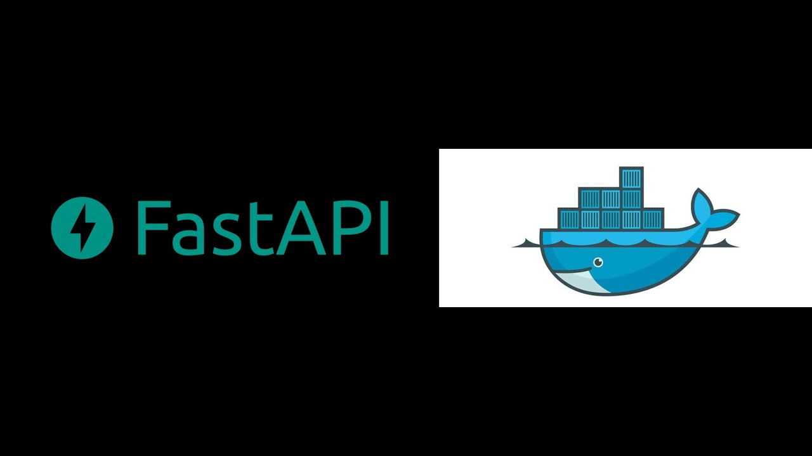

# &nbsp;&nbsp;&nbsp;

# MoS-Index

A Rest API for indexing metadata for Managed Objects.


## Table of Contents

* [Overview](#overview)
* [Design](#design)
* [Installation](#installation)
* [Execution](#execution)

Overview
---------
Managed objects (MOs) are the fundamental abstraction in procedures pertaining to engineering 
managed of operations and maintenance of wireless networks.

`MoS-Index` is a microservice which exposes metadata for MOs through 4 endpoints. The service exposes the following endpoints by
using a given yaml file as fixture:

1. `/class`: Given the name of the MO class, the endpoint returns a sequence of attribute, datatype pairs in JSON format.
2. `/attribute`: Given the name of the MO attribute, the endpoint returns the datatype, and all parent MO classes.
3. `/datatype`: Given the name of the datatype, the endpoint returns all MO attributes that belong to this type.
4. `/random`: This is a generic endpoint that returns a sequence of four response strings from the https://baconipsum.com/json-api/ public API.


### Technology stack

* [Python 3.7.x](https://www.python.org/)
* [Fastapi](https://fastapi.tiangolo.com/)
* [Pytest](https://docs.pytest.org/en/stable/)
* [Pytest-mock](https://github.com/pytest-dev/pytest-mock/)
* [Docker](https://www.docker.com/)

## Design

The service at startup loads the yaml file with the metadata in cache in order to parse it only one time. With the metadata in memory, the api
responds with simple `GET` operations by processing the cached file. 
The REST interface is roughly the following:

* `GET /class | query parameters: "class_name: the name of the MO class"`
* `GET /atrribute | query parameters: "attribute_name: MO attribute"`
* `GET /datatype | query parameters: "typename: name of the datatype"`
* `GET /random | query parameters: "type: <all-meat> or <meat-and-filler>", "sentences: number of sentences"(optional)`

Considering the `random` endpoint the service makes an internal get request to [BaconIsum API](https://baconipsum.com/json-api/) based on the 
upper level query parameters and returns the response in json format. At shutdown the service clears the cache and terminates the server.


## Installation

Installation guidelines can be found in [the installation document](documents/installation.md).

## Execution

Activate virtual environment:
```Python
$ source path2venv/bin/activate
```
Clone the project:
```bash
$ git clone https://github.com/giannisginis/MoS-Index.git
```
CD to project:
```bash
$ cd MoS_Index
```

Start uvicorn server locally:

```Python
$ uvicorn main:app --reload
```
Or if you prefer Start uvicorn server with `docker` (docker is required):

```Bash
$ docker-compose up
```
Make the request:
* You can try the service through the http://127.0.0.1:8000/docs thanks to automatic data model 
documentation provided by [Fastapi](https://fastapi.tiangolo.com/)
